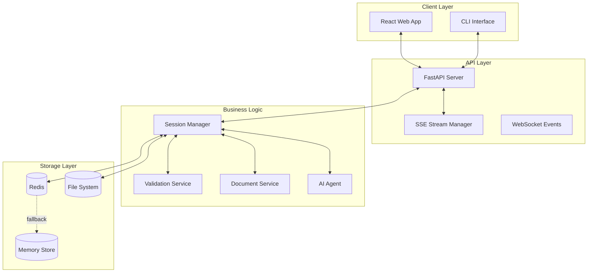
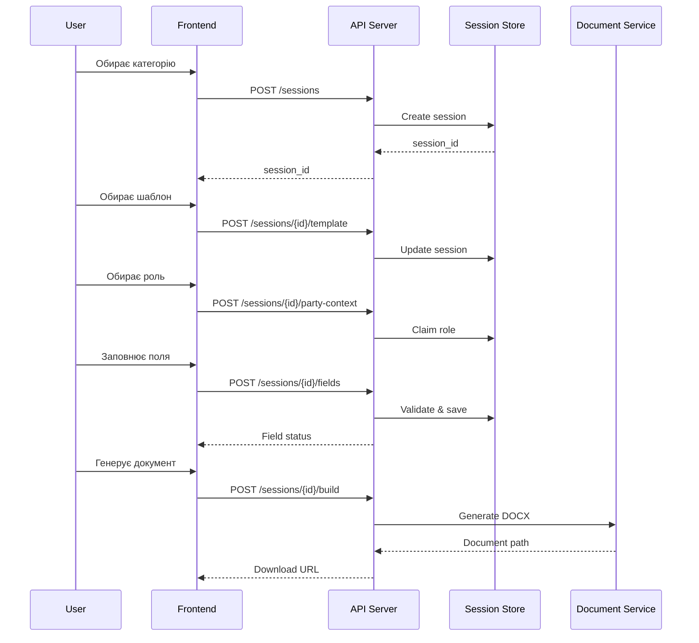
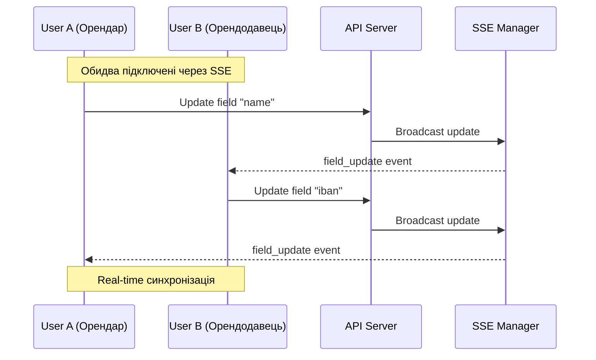
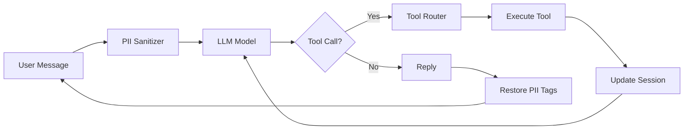
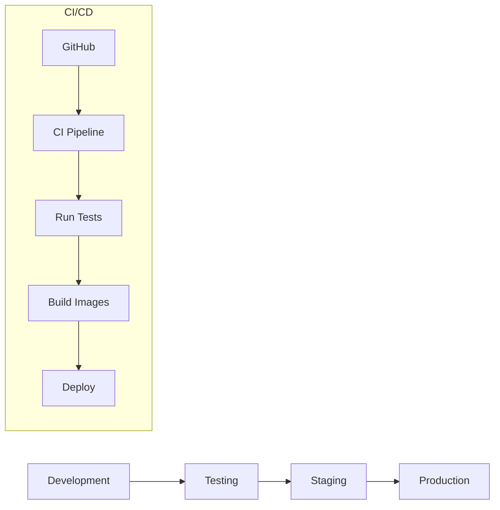

# 🏗️ Архітектура проекту Diia Hakaton - AI Contract Bot

## 📋 Зміст

- [Загальний огляд](#загальний-огляд)
- [Архітектура системи](#архітектура-системи)
- [Backend архітектура](#backend-архітектура)
- [Frontend архітектура](#frontend-архітектура)
- [Потоки даних](#потоки-даних)
- [Безпека](#безпека)
- [Масштабованість](#масштабованість)

## 🌐 Загальний огляд

Система побудована на основі мікросервісної архітектури з розділенням на Backend (FastAPI) та Frontend (React). Основна мета - автоматизація створення юридичних документів через веб-інтерфейс або AI-асистента.



## 🔧 Backend архітектура

### Основні компоненти

#### 1. **FastAPI Application** (`backend/api/http/server.py`)
- REST API endpoints
- CORS middleware
- SSE (Server-Sent Events) для real-time оновлень
- Lifecycle management з автоочищенням сесій

```python
# Основні ендпоінти
POST   /sessions                    # Створення нової сесії
GET    /sessions/{id}               # Отримання даних сесії
POST   /sessions/{id}/fields        # Оновлення поля
POST   /sessions/{id}/build         # Генерація документа
POST   /sessions/{id}/sync          # Пакетне оновлення
GET    /sessions/{id}/stream        # SSE підключення
POST   /chat                        # AI чат інтерфейс
```

#### 2. **Session Management** (`backend/domain/sessions/`)

##### Session Model (`models.py`)
```python
@dataclass
class Session:
    session_id: str
    user_id: Optional[str]
    updated_at: datetime
    
    # Метадані договору
    category_id: Optional[str]
    template_id: Optional[str]
    
    # Стан та ролі
    state: SessionState
    role: Optional[str]
    person_type: Optional[str]
    party_types: Dict[str, str]      # role -> person_type
    party_users: Dict[str, str]      # role -> user_id
    
    # Дані полів
    party_fields: Dict[str, Dict[str, FieldState]]  # role -> field -> state
    contract_fields: Dict[str, FieldState]
    
    # Підписи
    signatures: Dict[str, bool]
    is_fully_signed: bool
```

##### Session States
```python
class SessionState(Enum):
    IDLE = "idle"
    CATEGORY_SELECTED = "category_selected"
    TEMPLATE_SELECTED = "template_selected"
    COLLECTING_FIELDS = "collecting_fields"
    READY_TO_BUILD = "ready_to_build"
    BUILT = "built"
    READY_TO_SIGN = "ready_to_sign"
    COMPLETED = "completed"
```

#### 3. **Storage Layer** (`backend/domain/sessions/store.py`)

Трирівнева архітектура зберігання з автоматичним fallback:

```python
Redis Store (Primary)
    ↓ (fallback on error)
File System Store
    ↓ (fallback)
Memory Store (Always available)
```

##### Store Interface
```python
# Async методи (основні)
async def aget_or_create_session(session_id: str) -> Session
async def aload_session(session_id: str) -> Session
async def asave_session(session: Session) -> None
async def atransactional_session(session_id: str) -> AsyncContextManager[Session]
async def alist_user_sessions(user_id: str) -> List[Session]
```

#### 4. **AI Agent System** (`backend/agent/`)

##### Tool Registry Pattern
```python
@register_tool
class UpsertFieldTool(BaseTool):
    name = "upsert_field"
    
    async def execute(self, args: Dict, context: Dict) -> Any:
        # Validate field
        # Update session
        # Broadcast changes
        return result
```

##### Доступні інструменти:
- `find_category_by_query` - пошук категорії договору
- `set_category` - встановлення категорії
- `set_template` - вибір шаблону
- `set_party_context` - встановлення ролі та типу особи
- `upsert_field` - оновлення поля
- `build_contract` - генерація документа
- `sign_contract` - підпис договору

#### 5. **Document Generation** (`backend/domain/documents/`)

```python
async def build_contract_async(
    session_id: str, 
    template_id: str,
    partial: bool = False
) -> Dict[str, str]:
    # 1. Load session data
    # 2. Load template (.docx)
    # 3. Replace placeholders
    # 4. Generate output
    # 5. Optional: Convert to HTML/PDF
```

#### 6. **Validation System** (`backend/domain/validation/`)

##### PII Sanitizer
```python
def sanitize_typed(text: str) -> Dict:
    # Masks sensitive data:
    # IBAN: UA12345... → [IBAN#1]
    # Phone: +380... → [PHONE#1]
    # Tax ID: 3456... → [RNOKPP#1]
    return {
        "sanitized_text": masked_text,
        "tags": {"[IBAN#1]": "UA12345..."}
    }
```

##### Field Validators
```python
def validate_value(value_type: str, value: str) -> Tuple[str, Optional[str]]:
    validators = {
        "iban": validate_iban,
        "rnokpp": validate_tax_id,
        "edrpou": validate_company_code,
        "email": validate_email,
        "date": validate_date
    }
```

## 🎨 Frontend архітектура

### Component Structure

```
frontend/src/
├── App.jsx                 # Головний компонент з маршрутизацією
├── api.js                  # API клієнт
├── App.css                 # Глобальні стилі
└── components/
    ├── CategorySelector.jsx    # Вибір категорії
    ├── TemplateSelector.jsx    # Вибір шаблону
    ├── ModeSelector.jsx        # Вибір режиму заповнення
    ├── RoleSelector.jsx        # Вибір ролі
    ├── InputField.jsx          # Поле вводу з валідацією
    ├── SectionCard.jsx         # Картка секції
    ├── PreviewDrawer.jsx       # Попередній перегляд
    ├── Dashboard.jsx           # Список договорів
    ├── ContractDetails.jsx     # Деталі договору
    └── AIChat.jsx             # AI чат інтерфейс
```

### State Management

```javascript
// Основний стан додатку
const [step, setStep] = useState('category');
const [sessionId, setSessionId] = useState(null);
const [schema, setSchema] = useState(null);
const [formValues, setFormValues] = useState({});
const [fieldErrors, setFieldErrors] = useState({});

// SSE синхронізація
useEffect(() => {
    const eventSource = new EventSource(
        `/sessions/${sessionId}/stream?user_id=${userId}`
    );
    
    eventSource.onmessage = (event) => {
        const data = JSON.parse(event.data);
        if (data.type === 'field_update') {
            setFormValues(prev => ({
                ...prev,
                [data.field_key]: data.value
            }));
        }
    };
}, [sessionId]);
```

### API Client (`api.js`)

```javascript
const api = {
    // Session management
    createSession: () => axios.post('/sessions'),
    getSession: (id) => axios.get(`/sessions/${id}`),
    
    // Field updates with optimistic UI
    upsertField: async (sessionId, field, value, role) => {
        // Immediate UI update
        updateLocalState(field, value);
        
        // Background sync
        try {
            const res = await axios.post(`/sessions/${sessionId}/fields`, {
                field, value, role
            });
            // Confirm or rollback
        } catch (error) {
            rollbackLocalState(field);
        }
    }
};
```

## 🔄 Потоки даних

### 1. **Створення договору (повний цикл)**



### 2. **Multi-party співпраця**



### 3. **AI Assistant Flow**



## 🔐 Безпека

### 1. **Аутентифікація та авторизація**

```python
def check_session_access(
    session: Session,
    user_id: str,
    require_participant: bool = False
):
    # Check if session is full (all roles taken)
    is_full = len(session.party_users) >= expected_roles_count
    
    if is_full or require_participant:
        # Only participants can access
        if user_id not in session.party_users.values():
            raise HTTPException(403, "Not a participant")
```

### 2. **PII Protection**

```python
# Маскування перед відправкою в LLM
sanitized = sanitize_typed(user_message)
# user: "Мій IBAN UA123456789012345678901234567"
# LLM sees: "Мій IBAN [IBAN#1]"

# Відновлення при збереженні
if tool_name == "upsert_field":
    real_value = restore_pii(args["value"], tags)
```

### 3. **Signature Integrity**

```python
def update_session_field(session, field, value):
    # Check if current user has signed
    if session.signatures.get(current_role):
        raise ValueError("Cannot edit after signing")
    
    # Invalidate other signatures on change
    for role, signed in session.signatures.items():
        if signed and role != current_role:
            session.signatures[role] = False
```

## 📈 Масштабованість

### Горизонтальне масштабування

```yaml
# docker-compose.scale.yml
services:
  app:
    deploy:
      replicas: 3
      
  nginx:
    image: nginx
    ports:
      - "80:80"
    volumes:
      - ./nginx.conf:/etc/nginx/nginx.conf
      
  redis:
    image: redis:alpine
    deploy:
      replicas: 1
```

### Оптимізації продуктивності

1. **Session Caching**
   - Redis TTL: 24 години
   - Memory cache для активних сесій
   - Lazy loading полів

2. **Document Generation**
   - Async processing
   - Template caching
   - Parallel field validation

3. **Real-time Updates**
   - SSE замість WebSocket (менше навантаження)
   - Selective broadcasting
   - Client-side debouncing

### Моніторинг та логування

```python
# Structured logging
logger.info(
    "session_update",
    session_id=session_id,
    field=field_name,
    user_id=user_id,
    duration_ms=elapsed
)

# Metrics collection
@app.middleware("http")
async def add_metrics(request: Request, call_next):
    start = time.time()
    response = await call_next(request)
    duration = time.time() - start
    
    metrics.histogram(
        "http_request_duration_seconds",
        duration,
        labels={"method": request.method, "path": request.url.path}
    )
```

## 🔄 Deployment Pipeline



### Environment Configuration

```bash
# .env.production
APP_HOST=0.0.0.0
APP_PORT=8000
REDIS_URL=redis://redis:6379/0
SESSION_BACKEND=redis
LLM_MODEL=gpt-4o-mini
CORS_ORIGINS=https://app.example.com
```

## 📚 Додаткові ресурси

- [API Documentation](/docs) - Swagger/OpenAPI специфікація
- [Component Storybook](/storybook) - UI компоненти
- [Performance Metrics](/metrics) - Grafana dashboard
- [Logs](/logs) - ELK Stack integration

---

**Версія:** 1.0.0  
**Останнє оновлення:** Листопад 2024  
**Автор:** AI Contract Bot Team
